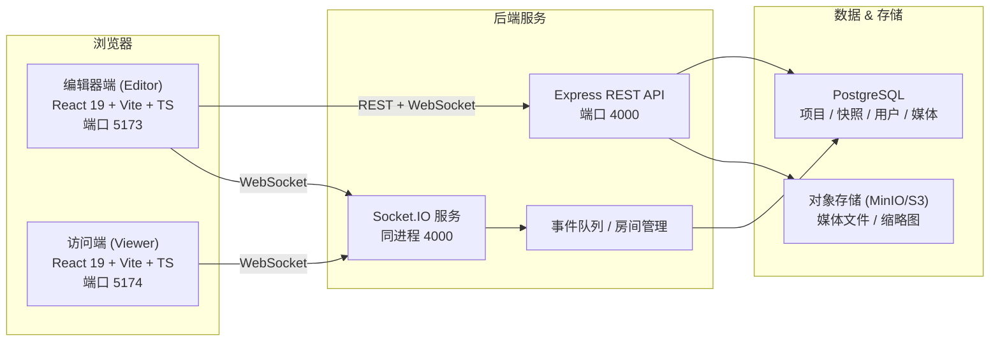
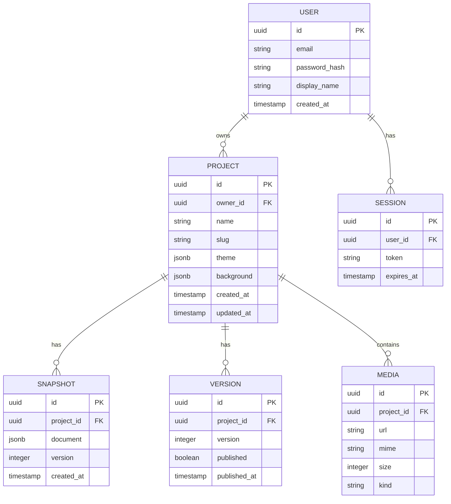

# LightGlass — 技术架构文档

> 现代化 Web 可视化桌面编辑系统：Monorepo 架构、编辑端 / 访问端 / 后端服务三端分离，WebSocket 实时同步。

---

## 1. 架构设计



**核心思想**：
- 三个独立进程：`editor` (Vite dev 5173) / `viewer` (Vite dev 5174) / `server` (Express 4000)
- 编辑器改动 → POST `/api/projects/:id/snapshots` + Socket 广播 `project:update`
- 访问端订阅房间 `project:<id>`，收到事件后重新拉取快照或应用增量 patch
- 静态文件以 CDN 友好的方式构建，server 同时提供 API

---

## 2. 技术栈

| 维度 | 选型 |
|------|------|
| 前端框架 | React 19 + TypeScript + Vite 5 |
| 样式 | TailwindCSS 3 + CSS Variables（主题切换） |
| 状态 | Zustand（编辑态 / 文档树 / 选中集 / 历史栈） |
| 动效 | Framer Motion 11 |
| 拖拽 / 缩放 | react-moveable + 自研吸附 / 辅助线 |
| 布局 | 自研绝对定位布局（更贴近 Windows 桌面，非 grid） |
| 实时 | Socket.IO 4 客户端 + 服务端 |
| 后端 | Node.js 20 + Express 4 + TypeScript (ESM) |
| 数据库 | PostgreSQL 16（项目、快照、用户、媒体、版本） |
| ORM | Drizzle ORM（轻量、TS-first） |
| 文件存储 | MinIO（S3 兼容） |
| 鉴权 | JWT (httpOnly cookie) + bcrypt |
| 校验 | Zod（前后端共用 schema） |
| 日志 | Pino |
| 测试 | Vitest（单测）+ Supertest（接口） |
| 包管理 | pnpm workspaces (Monorepo) |

---

## 3. Monorepo 目录结构

```
lightglass/
├── pnpm-workspace.yaml
├── package.json
├── .env.example
├── README.md
├── docs/
│   ├── PRD.md
│   ├── ARCHITECTURE.md
│   ├── API.md
│   ├── WEBSOCKET.md
│   ├── JSON_SCHEMA.md
│   └── UI_PROTOTYPE.md
├── packages/
│   ├── shared/                 # 前后端共享类型 / Schema / 常量
│   │   ├── package.json
│   │   ├── tsconfig.json
│   │   └── src/
│   │       ├── types/          # Project, Window, Component, Theme...
│   │       ├── schemas/        # Zod schemas
│   │       ├── events/         # Socket.IO 事件契约
│   │       └── index.ts
│   ├── editor/                 # 编辑器端 (Vite + React 19)
│   │   ├── package.json
│   │   ├── vite.config.ts
│   │   ├── index.html
│   │   └── src/
│   │       ├── main.tsx
│   │       ├── App.tsx
│   │       ├── routes/
│   │       │   ├── ConsolePage.tsx
│   │       │   ├── EditorPage.tsx
│   │       │   └── LoginPage.tsx
│   │       ├── components/
│   │       │   ├── shell/        # 顶栏 / 侧栏 / 状态栏
│   │       │   ├── canvas/       # 桌面画布 / 窗口 / 选择
│   │       │   ├── window/       # 窗口标题栏 / 装饰
│   │       │   ├── widgets/      # 文字 / 图片 / 视频 / 音频 / Web
│   │       │   ├── panels/       # 属性 / 主题 / 背景 / 动画
│   │       │   └── ui/           # 通用控件
│   │       ├── store/            # Zustand stores
│   │       ├── hooks/
│   │       ├── lib/              # WS / 吸附 / 辅助线 / 历史
│   │       ├── themes/           # 主题样式 / CSS
│   │       └── styles/
│   ├── viewer/                 # 访问端 (Vite + React 19)
│   │   ├── package.json
│   │   ├── vite.config.ts
│   │   ├── index.html
│   │   └── src/
│   │       ├── main.tsx
│   │       ├── App.tsx
│   │       ├── routes/
│   │       │   └── ViewPage.tsx
│   │       ├── components/
│   │       │   ├── canvas/       # 只读画布
│   │       │   ├── window/       # 只读窗口
│   │       │   └── widgets/      # 同 editor，但 props 锁定只读
│   │       ├── store/
│   │       ├── hooks/
│   │       └── styles/
│   └── server/                 # 后端 Express + Socket.IO
│       ├── package.json
│       ├── tsconfig.json
│       └── src/
│           ├── index.ts          # 入口
│           ├── app.ts            # Express 实例
│           ├── config/           # 环境变量
│           ├── db/               # Drizzle schema + 迁移
│           ├── routes/           # REST 路由
│           │   ├── auth.routes.ts
│           │   ├── project.routes.ts
│           │   ├── snapshot.routes.ts
│           │   ├── media.routes.ts
│           │   └── json.routes.ts
│           ├── services/
│           │   ├── project.service.ts
│           │   ├── snapshot.service.ts
│           │   ├── media.service.ts
│           │   └── storage.service.ts
│           ├── ws/               # Socket.IO 房间 / 事件
│           │   ├── server.ts
│           │   ├── rooms.ts
│           │   └── handlers.ts
│           ├── middleware/       # auth / error / cors
│           └── utils/
└── docker-compose.yml          # 一键启动 PG + MinIO
```

---

## 4. 路由定义

| 应用 | 路由 | 用途 |
|------|------|------|
| editor | `/login` | 登录 |
| editor | `/console` | 项目控制台 |
| editor | `/editor/:projectId` | 编辑器主界面 |
| viewer | `/view/:projectId` | 访问端只读 |
| editor | `/settings` | 个人设置 |

后端 REST 路由（详见 [API.md](./API.md)）：

| Method | Path | 用途 |
|--------|------|------|
| POST | `/api/auth/register` | 注册 |
| POST | `/api/auth/login` | 登录，返回 JWT |
| POST | `/api/auth/logout` | 注销 |
| GET | `/api/auth/me` | 当前用户 |
| GET | `/api/projects` | 我的项目列表 |
| POST | `/api/projects` | 新建项目 |
| GET | `/api/projects/:id` | 项目详情 |
| PATCH | `/api/projects/:id` | 更新项目元信息 |
| DELETE | `/api/projects/:id` | 删除项目 |
| POST | `/api/projects/:id/snapshots` | 保存快照（编辑器写入） |
| GET | `/api/projects/:id/snapshots/latest` | 获取最新快照（访问端读取） |
| POST | `/api/projects/:id/publish` | 发布版本 |
| GET | `/api/projects/:id/versions` | 版本列表 |
| POST | `/api/media/upload` | 上传媒体 |
| GET | `/api/media/:id` | 读取媒体 |
| POST | `/api/json/window/validate` | JSON 窗口 Schema 校验 |

---

## 5. 数据模型



### 5.1 关键 DDL

```sql
CREATE TABLE users (
  id UUID PRIMARY KEY DEFAULT gen_random_uuid(),
  email TEXT UNIQUE NOT NULL,
  password_hash TEXT NOT NULL,
  display_name TEXT,
  created_at TIMESTAMPTZ DEFAULT NOW()
);

CREATE TABLE projects (
  id UUID PRIMARY KEY DEFAULT gen_random_uuid(),
  owner_id UUID REFERENCES users(id) ON DELETE CASCADE,
  name TEXT NOT NULL,
  slug TEXT UNIQUE NOT NULL,
  theme JSONB DEFAULT '{}'::jsonb,
  background JSONB DEFAULT '{}'::jsonb,
  created_at TIMESTAMPTZ DEFAULT NOW(),
  updated_at TIMESTAMPTZ DEFAULT NOW()
);

CREATE TABLE snapshots (
  id UUID PRIMARY KEY DEFAULT gen_random_uuid(),
  project_id UUID REFERENCES projects(id) ON DELETE CASCADE,
  document JSONB NOT NULL,
  version INT NOT NULL,
  created_at TIMESTAMPTZ DEFAULT NOW(),
  UNIQUE(project_id, version)
);

CREATE TABLE versions (
  id UUID PRIMARY KEY DEFAULT gen_random_uuid(),
  project_id UUID REFERENCES projects(id) ON DELETE CASCADE,
  version INT NOT NULL,
  published BOOLEAN DEFAULT FALSE,
  published_at TIMESTAMPTZ
);

CREATE TABLE media (
  id UUID PRIMARY KEY DEFAULT gen_random_uuid(),
  project_id UUID REFERENCES projects(id) ON DELETE CASCADE,
  url TEXT NOT NULL,
  mime TEXT NOT NULL,
  size INT NOT NULL,
  kind TEXT NOT NULL,
  created_at TIMESTAMPTZ DEFAULT NOW()
);
```

---

## 6. WebSocket 同步方案

详见 [WEBSOCKET.md](./WEBSOCKET.md)。要点：

- 房间：`project:<projectId>`
- 事件：
  - `editor:join` / `editor:leave` 编辑器进入 / 离开
  - `viewer:join` / `viewer:leave` 访问端进入 / 离开
  - `project:update` 编辑器推送增量 patch（CRDT-lite）
  - `project:full` 全量快照（兜底 / 访问端首屏）
  - `presence:update` 协同光标 / 选中态
  - `media:play` 媒体播放同步（可选）
- 鉴权：连接时携带 `token`（JWT 或匿名 viewer token），服务端校验后加入房间
- 编辑器节流：100ms 内合并多次 patch

---

## 7. JSON 配置规范

详见 [JSON_SCHEMA.md](./JSON_SCHEMA.md)。核心 `ProjectDocument`：

```ts
interface ProjectDocument {
  version: 1;
  background: BackgroundConfig;
  theme: ThemeConfig;
  windows: WindowConfig[];
  audio?: AudioConfig; // 全局背景音乐
}

interface WindowConfig {
  id: string;
  title: string;
  x: number; y: number;
  width: number; height: number;
  zIndex: number;
  locked?: { position?: boolean; size?: boolean };
  style: { opacity?: number; radius?: number; shadow?: ShadowConfig };
  animation?: { open?: AnimSpec; close?: AnimSpec; loop?: AnimSpec };
  content: ContentConfig;
}

type ContentConfig =
  | { type: 'text'; props: TextProps }
  | { type: 'image'; props: ImageProps }
  | { type: 'video'; props: VideoProps }
  | { type: 'audio'; props: AudioProps }
  | { type: 'web'; props: WebProps };
```

---

## 8. React 组件架构（编辑器端）

```
<App>
  <AuthProvider>
    <SocketProvider>
      <Router>
        <Route /editor/:id>
          <EditorShell>
            <TopBar />
            <LeftPanel>
              <ComponentLibrary />
              <LayerTree />
            </LeftPanel>
            <CanvasArea>
              <BackgroundLayer />
              <WindowStack>
                <WindowFrame>
                  <WindowHeader />
                  <WidgetRenderer />  // 分发到 Text/Image/Video/Audio/Web
                </WindowFrame>
              </WindowStack>
              <SelectionOverlay />
              <GuidesLayer />          // 对齐辅助线
            </CanvasArea>
            <RightPanel>
              <Inspector />
              <ThemePanel />
              <BackgroundPanel />
              <AnimationPanel />
            </RightPanel>
            <StatusBar />
          </EditorShell>
        </Route>
      </Router>
    </SocketProvider>
  </AuthProvider>
</App>
```

### 8.1 Store 切分（Zustand）

- `useDocumentStore` 当前 ProjectDocument
- `useSelectionStore` 选中 / 多选 / 拖拽态
- `useHistoryStore` 撤销 / 重做栈（基于 immer patches）
- `useUIStore` 主题 / 面板展开 / 网格 / 辅助线开关
- `useSocketStore` 连接状态 / 在线协作者

### 8.2 历史栈策略
- 每次 patch 通过 `immer` 生成反向 patch，存入 ring buffer（最多 50 步）
- 快捷键：Ctrl/Cmd+Z / Ctrl/Cmd+Shift+Z / Ctrl/Cmd+C/V/D
- 切忌把视频帧 / 像素级变更入栈

---

## 9. 编辑器实现要点

| 能力 | 方案 |
|------|------|
| 拖拽 | `react-moveable` + 自研 Snap（阈值 4px）|
| 多选 | 框选 / Shift 加选；多选时显示包围盒与对齐参考线 |
| 网格 | 8px 基础网格，吸附可开关 |
| 缩放 | 8 个 handle + 角点，Alt 保持比例 |
| Z-Index | 调整时最小化变更、记录到历史 |
| 吸附 | X / Y 中心 / 边缘 / 兄弟窗口 |
| 快捷键 | 统一注册在 `useHotkeys`，避免全局冲突 |
| 复制粘贴 | 系统剪贴板存 JSON，与外部文本兼容 |

---

## 10. 访问端实现要点

- 入口 `ViewPage` 拉取 `latest snapshot`，进入后建立 WebSocket 订阅
- 渲染层 100% 复用 `WidgetRenderer`，但 `readOnly=true` 禁用所有 editor-only 控件
- 自适应：根据视口缩放桌面画布，窗口按 `responsiveScale` 缩放
- 媒体自动播放：访问端 mute 后尝试 `autoplay`，被浏览器阻止时显示播放提示
- 断线：UI 顶部显示"连接已断开"提示，恢复后自动重拉快照

---

## 11. 视觉主题实现

| 主题 | 实现 |
|------|------|
| Liquid Glass | `backdrop-filter` + SVG noise + 高光梯度 + 多层 box-shadow |
| Acrylic | `backdrop-filter: blur(40px) saturate(180%)` + 1px 渐变描边 |
| Glassmorphism | `backdrop-filter: blur(20px)` + 1px 边框 + 高光 |
| Fluent 11 | Mica-like 多层 + 标题栏分段 |
| Custom | 接受 CSS 字符串或 JSON，注入运行时 |

---

## 12. 部署与运行

- 开发：`pnpm dev` 同时启动 editor / viewer / server
- 生产：
  - `pnpm --filter @lightglass/editor build` → 静态资源
  - `pnpm --filter @lightglass/viewer build` → 静态资源
  - `pnpm --filter @lightglass/server build` → Node 进程
  - 由 server 反向代理 editor 与 viewer 的静态资源
- 依赖服务：`docker compose up -d` 启动 PostgreSQL + MinIO

---

## 13. 安全要点

- JWT 存于 `httpOnly` cookie
- 访问端通过项目级 `viewer_token` 拉取快照，token 不可写
- 编辑器写入 `snapshot` 必须验证 `project.owner === user.id`
- 媒体上传限制 mime + 大小；URL 外链需 ssrf 防护
- JSON 窗口上传使用 Zod 严格校验

---

## 14. 性能与可观测

- 编辑器：选择 / 拖拽用 transform 替代 top/left 避免回流
- 访问端：媒体懒加载，可见窗口优先
- 日志：pino 接入，开发环境 pretty 打印
- 指标：暴露 `/metrics` 给 Prometheus（可选）

---

## 15. 风险与缓解

| 风险 | 缓解 |
|------|------|
| 浏览器 autoplay 限制 | 静音 + 用户首次点击后激活 |
| 复杂文档性能 | 视口裁剪 / 离屏 canvas / 虚拟化 |
| WebSocket 不稳定 | 指数退避重连 + 兜底轮询 |
| 主题 CSS 注入安全 | DOMPurify 清洗 + 严格白名单 |
