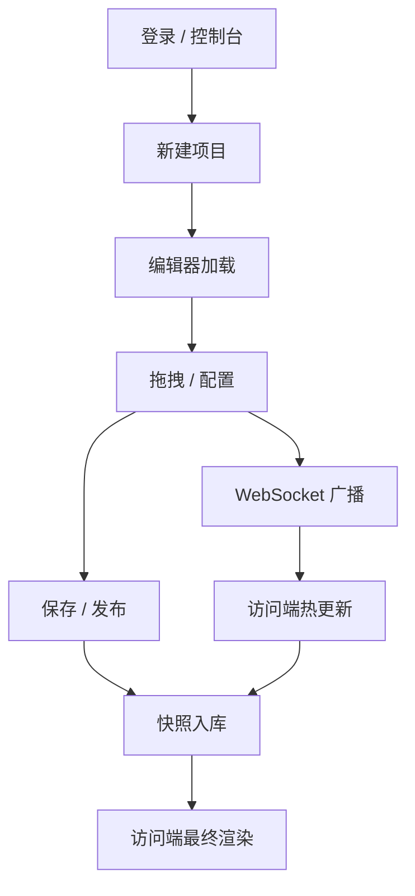

# LightGlass — 产品需求文档 (PRD)

> 现代化 Web 可视化桌面编辑系统：所见即所得的 WYSIWYG Web 桌面平台，编辑端与访问端完全分离。

---

## 1. 产品概述

LightGlass 是一款运行在浏览器中的「类 Windows 11 桌面」可视化编辑与发布平台。设计者通过**编辑器端**拖拽式搭建桌面、窗口、组件与主题；终端用户通过**访问端**只读体验设计结果，编辑端与访问端通过 WebSocket 实时同步。

- **核心价值**：让"非工程用户"能够零代码搭建一个具备 Windows 11 Fluent 视觉质感的 Web 桌面，并通过链接实时分享。
- **目标用户**：企业内部仪表盘制作者、Kiosk 大屏设计师、教学演示作者、活动 / 落地页主理人。
- **市场定位**：比 Wix 更"桌面化"，比 Web OS Demo 更"可生产"。

---

## 2. 核心功能

### 2.1 用户角色

| 角色 | 注册方式 | 核心权限 |
|------|----------|----------|
| 设计者 (Designer) | 邮箱 + 密码 | 编辑 / 保存 / 导出项目；获取访问端分享链接 |
| 访客 (Viewer) | 无需注册 | 通过访问端链接查看与交互，不能编辑 |
| 管理员 (Admin) | 邀请制 | 管理项目、用户、配额、文件存储 |

### 2.2 功能模块

1. **编辑器端 (`/editor`)**：可视化桌面画布、窗口系统、组件系统、主题与动画、项目管理
2. **访问端 (`/view/:projectId`)**：只读渲染、响应式适配、实时同步、媒体播放
3. **控制台 (`/console`)**：项目列表、新建 / 导入 / 导出、版本管理、文件存储
4. **认证 (`/auth`)**：登录 / 注册 / 注销 / 权限隔离

### 2.3 页面详情

| 页面名称 | 模块名称 | 功能描述 |
|----------|----------|----------|
| 登录页 | 登录表单 | 邮箱密码登录、深色玻璃风、Logo 居中 |
| 控制台首页 | 项目卡片网格 | 我的项目、最近编辑、模板库入口、搜索/筛选 |
| 编辑器 | 顶部工具栏 | 撤销/重做、保存、预览、发布、JSON 导入导出、主题切换 |
| 编辑器 | 左侧组件库 | 文字/图片/视频/音频/Web 组件，拖拽至画布 |
| 编辑器 | 中央画布 | 桌面背景 + 窗口堆叠，多选、吸附网格、对齐辅助线 |
| 编辑器 | 右侧属性面板 | 选中对象的尺寸、位置、样式、动画、Z-Index、锁定 |
| 编辑器 | 背景设置 | 图片/纯色/渐变背景，实时预览 |
| 编辑器 | 主题面板 | Liquid Glass / Acrylic / Glassmorphism / Fluent 11 / 自定义 |
| 访问端 | 桌面画布 | 只读渲染窗口、播放媒体、响应式 |
| 访问端 | 同步状态 | 显示与编辑器的连接状态、断线提示 |

---

## 3. 核心流程

### 3.1 设计流程
1. 设计者登录 → 控制台 → 新建项目
2. 编辑器加载空白桌面 → 拖入组件 / 调整窗口 → 实时保存到后端
3. 通过 WebSocket 广播布局变更 → 所有已打开的访问端立即热更新
4. 设计者点击"发布" → 锁定版本，访问端只读渲染该版本

### 3.2 观看流程
1. 访客打开访问端链接 → 后端返回最新已发布快照
2. WebSocket 建立连接 → 接收后续变更
3. 访客可缩放 / 平移窗口（视项目配置而定），不可编辑
4. 媒体自动播放或点击播放，遵循项目内动效与音视频设置

---

## 4. 用户界面设计

### 4.1 设计风格
- **主色调**：`#0B0F1A` 深空底色 + `#7C5CFF` 紫罗兰主色 + `#36E0C7` 青绿强调色
- **次色**：`#FF7AB6` 玫红警示 / `#FFB454` 暖橙提示
- **按钮**：圆角 12px、毛玻璃背板 + 1px 高光描边、hover 浮起 + 阴影
- **字体**：标题用 `Sora` / `Space Grotesk`，正文用 `Inter`，数字用 `JetBrains Mono`
- **布局**：顶部 56px 工具栏 + 左侧 64px 折叠组件库 + 右侧 320px 属性面板 + 中央自适应画布
- **图标**：Lucide React，1.5px 描边
- **暗色优先**：默认深色，提供浅色切换

### 4.2 页面设计概览

| 页面 | 模块 | UI 元素 |
|------|------|----------|
| 登录页 | 卡片 | 居中毛玻璃卡片，左侧品牌插画，右侧表单，输入框带浮动 label |
| 控制台 | 顶栏 | Logo、搜索框、用户头像下拉 |
| 控制台 | 项目网格 | 大圆角卡片 16:9 缩略图、悬浮显示项目名 + 操作 |
| 编辑器 | 工具栏 | 玻璃条，左中右三段；撤销/重做、保存状态指示灯 |
| 编辑器 | 组件库 | 折叠式分类，可拖拽 |
| 编辑器 | 画布 | 桌面背景可设，窗口带 macOS 风格红黄绿三圆 + 标题栏 |
| 编辑器 | 属性面板 | 分组折叠：位置 / 尺寸 / 样式 / 动画 / 高级 |
| 访问端 | 桌面 | 与编辑器 1:1 渲染，禁用一切选中与编辑态 |

### 4.3 响应式
- 桌面优先：编辑器 ≥ 1280px 编辑体验最佳
- 访问端自适应：≥ 1280 PC / 768-1279 平板 / < 768 手机
- DPI / Retina：所有位图资源二倍图，CSS 矢量优先

### 4.4 视觉与动效
- 玻璃质感：Frosted Glass + 内描边 + 1px 高光 + 阴影
- 动效：Framer Motion 弹性缓动，进入 stagger 80ms
- 鼠标交互：拖拽时实线辅助线 + 数值气泡
- 微反馈：按钮按下 0.95 缩放，hover 抬升 2px

---

## 5. 非功能性需求

| 维度 | 要求 |
|------|------|
| 性能 | 编辑器 60fps，访问端首屏 < 1.5s (局域网) |
| 安全 | 访问端完全只读，鉴权基于 JWT + 项目级访问令牌 |
| 可用性 | 99.5% (单实例) |
| 浏览器 | Chrome / Edge ≥ 110, Safari ≥ 16, Firefox ≥ 110 |
| 国际化 | 预留 i18n，默认中/英 |
| 可扩展 | 窗口组件可注册式扩展 |

---

## 6. 里程碑

| 阶段 | 周期 | 目标 |
|------|------|------|
| M1 基础 | 2 周 | Monorepo 脚手架、登录、控制台、数据库 |
| M2 编辑器 | 3 周 | 画布、窗口、组件库、属性面板 |
| M3 访问端 | 1 周 | 只读渲染、响应式、WebSocket 同步 |
| M4 主题 | 2 周 | 玻璃 / 亚克力 / Fluent / 自定义 |
| M5 发布 | 1 周 | 快照、版本、分享链接、媒体上传 |
