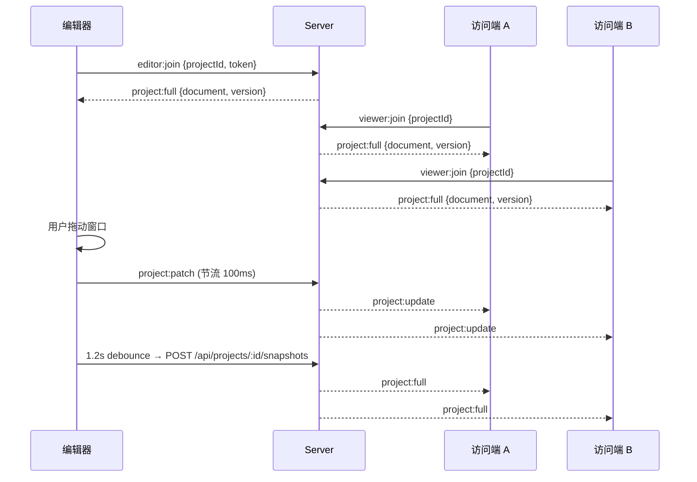

# LightGlass WebSocket 同步方案

> 基于 Socket.IO 4, 端口同 HTTP 服务 (4000), 路径默认 `/socket.io`。
> 房间命名: `project:<projectId>`。

---

## 1. 连接与鉴权

```ts
const socket = io('http://localhost:4000', {
  transports: ['websocket', 'polling'],
  // 编辑器: 通过 token 鉴权
  // 访问端: 可选 token (公开项目)
});
```

### 房间模型

每个项目一个房间, 进入房间必须 `emit` 以下之一:

| 事件 | 角色 | Payload | 副作用 |
|------|------|---------|--------|
| `editor:join` | 编辑者 | `{ projectId, token }` | 服务端校验 token, 加入房间, 立即推 `project:full` |
| `viewer:join` | 访问者 | `{ projectId, token? }` | 加入房间, 立即推 `project:full` |
| `editor:leave` / `viewer:leave` | — | — | 离开房间 |

---

## 2. 事件清单

### 客户端 → 服务端

| 事件 | Payload | 含义 |
|------|---------|------|
| `project:patch` | `{ projectId, patches, baseVersion }` | 编辑器增量 patch 广播 (内存级, 不入库) |
| `project:request-full` | `{ projectId }` | 请求全量快照 (兜底) |
| `presence:publish` | `{ projectId, selection?, cursor? }` | 协作者状态 (选中 / 光标) |
| `media:publish` | `{ projectId, action, ... }` | 媒体播放同步 (可选) |

### 服务端 → 客户端

| 事件 | Payload | 含义 |
|------|---------|------|
| `project:update` | `{ projectId, patches, version, ts }` | 增量更新 (与 `project:patch` 一致) |
| `project:full` | `{ projectId, document, version, ts }` | 全量快照 (首屏 / 兜底) |
| `presence:update` | `{ projectId, members: [...] }` | 协作者列表 |
| `media:play` | `{ projectId, action, ... }` | 媒体播放同步 |
| `error:message` | `{ code, message }` | 错误 |

---

## 3. Patch 协议

```ts
interface WindowPatch {
  id: string;
  /** 字段为 null 表示删除整个窗口 */
  fields: Partial<{
    x: number; y: number;
    width: number; height: number;
    zIndex: number; title: string;
    style: Record<string, unknown>;
    content: Record<string, unknown>;
  }> | null;
}
```

`fields === null` 即"删除窗口"; `fields` 含具体键即"局部更新"。

---

## 4. 时序图 (典型)



---

## 5. 断线 / 重连策略

- 服务端: 客户端断开时自动从房间移除
- 客户端 (访问端):
  1. `connect` 立即 `viewer:join`
  2. `disconnect` 显示"已离线"提示, 启动 5s 兜底轮询 `GET /api/snapshots/public/:id/latest`
  3. 重连成功后取消轮询, 重新 `viewer:join`
- 编辑器:
  1. 仍保留最近一次本地状态, 离线时编辑会继续累积在本地 store
  2. 重连后通过 `project:request-full` 拉一次最新快照兜底

---

## 6. 性能优化

- **节流**: 编辑器在 100ms 内合并多次 `project:patch`
- **落库节流**: `POST /snapshots` 由前端 1.2s debounce, 避免抖动落库
- **patch 体积控制**: 仅上传 `fields` 差异, 不传未改动字段
- **房间隔离**: 每个项目一个房间, 互不干扰

---

## 7. 客户端封装 (编辑器)

```ts
// packages/editor/src/lib/socket.ts
import { io } from 'socket.io-client';
const socket = io({ withCredentials: true });
socket.emit('editor:join', { projectId, token });
socket.on('project:full', (p) => { /* 同步到 store */ });
socket.on('project:update', (p) => { /* 增量 patch */ });
```

## 8. 客户端封装 (访问端)

```ts
// packages/viewer/src/App.tsx (节选)
const socket = io();
socket.emit('viewer:join', { projectId });
socket.on('project:full', setDoc);
socket.on('project:update', () => fetchInitial());
```

---

## 9. 安全

- 编辑器 WS 连接必须携带有效 JWT, 服务端用 `verifyToken` 校验
- 访问端可匿名, 但房间内的 `project:patch` 事件只允许 editor 发送
- 服务端拒绝来自非房间成员的 `media:publish` / `presence:publish`
- 所有事件字段使用 Zod 进一步校验 (建议生产环境补齐)
